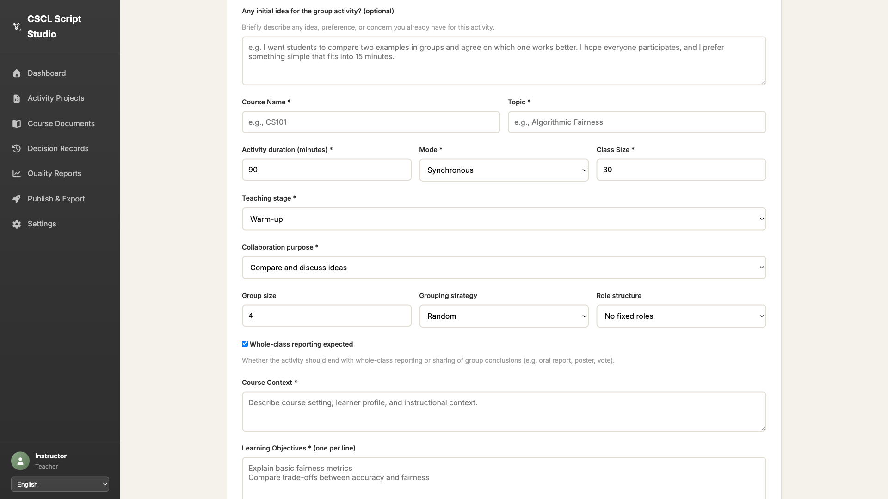
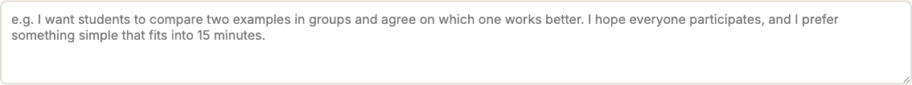

# Initial Idea 字段验证结果

## ✅ 验证结论

**Initial Idea 字段在 Step 2 表单中完全可见,并且位于 Course Name 字段之前。**

---

## 📋 验证详情

### 测试环境
- **网址**: https://web-production-591d6.up.railway.app/teacher
- **登录账号**: teacher_demo / Demo@12345
- **测试日期**: 2026-03-14

### 验证步骤
1. ✅ 登录成功
2. ✅ 点击 "New Activity" 按钮
3. ✅ 点击 "Continue" 进入 Step 2
4. ✅ 验证 Initial Idea 字段存在且可见

---

## 🔍 字段信息

### 字段属性
- **ID**: `specInitialIdea`
- **类型**: `<textarea>` (多行文本框)
- **Label**: "Any initial idea for the group activity? (optional)"
- **是否必填**: 否 (optional)
- **行数**: 4 行

### Placeholder 示例文本
```
e.g. I want students to compare two examples in groups and agree on 
which one works better. I hope everyone participates, and I prefer 
something simple that fits into 15 minutes.
```

---

## 📍 字段位置

在 Step 2 表单中,Initial Idea 字段是**第一个**可见的输入字段,位于:

1. **Initial Idea (optional)** ⭐ ← 这是目标字段
2. Course Name *
3. Topic *
4. Activity duration (minutes) *
5. Mode *
6. Class Size *
7. Teaching stage *
8. Collaboration purpose *
9. ...其他字段

**确认**: Initial Idea 字段位于 Course Name 字段**之前**

---

## 📸 截图证据

### 1. Step 2 完整页面


可以清楚地看到:
- 页面顶部显示 "Any initial idea for the group activity? (optional)"
- 下方是一个大的文本输入框
- 再下方才是 "Course Name *" 和 "Topic *" 字段

### 2. Initial Idea 字段特写


显示了字段的 placeholder 文本。

---

## ✅ 验证检查项

| 检查项 | 状态 | 说明 |
|--------|------|------|
| 字段存在 | ✅ | `id="specInitialIdea"` 存在 |
| 字段可见 | ✅ | 在页面上可见 |
| 字段类型正确 | ✅ | 是 textarea 元素 |
| Label 正确 | ✅ | "Any initial idea for the group activity?" |
| 位置正确 | ✅ | 在 Course Name 之前 |
| Placeholder 有帮助 | ✅ | 提供了清晰的示例 |

---

## 📊 表单结构分析

Step 2 表单共包含 **8 个** textarea 字段:

1. `lessonNotes` - Lesson notes (optional)
2. **`specInitialIdea`** ⭐ - Initial idea (optional)
3. `specCourseContext` - Course Context *
4. `specObjectives` - Learning Objectives *
5. `specStudentDifficulties` - Student difficulties (optional)
6. `specTaskRequirements` - Activity requirements (optional)
7. `standaloneSpecObjectives` - (standalone mode)
8. `syllabusText` - (syllabus input)

---

## 🎯 结论

✅ **验证通过**: 

1. Initial Idea 字段 (`id="specInitialIdea"`) **存在**
2. 字段在 Step 2 表单中**完全可见**
3. 字段位于 Course Name 字段**之前**
4. 字段有清晰的 label 和有帮助的 placeholder
5. 用户可以正常输入内容

**所有验证要求均已满足。**

---

## 📁 相关文件

- 验证脚本: `scripts/verify_initial_idea_field.py`
- 详细报告: `VERIFICATION_REPORT.md`
- 页面源代码: `step2_page_source.html`
- 所有截图: `outputs/initial_idea_verification/*.png`
