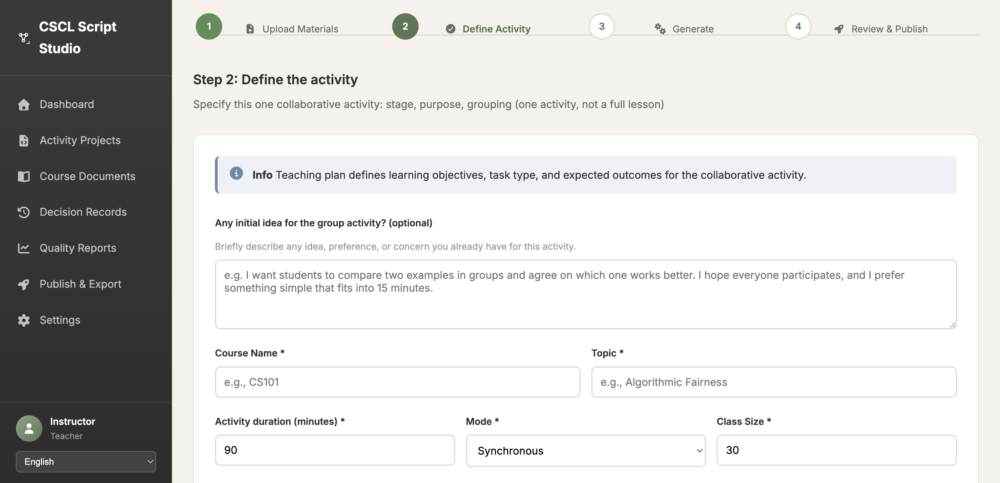
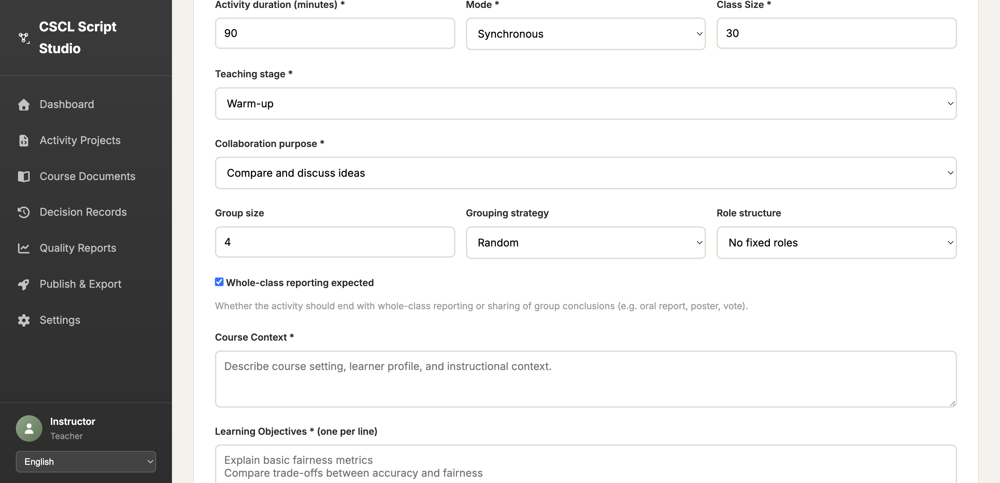

# Step 2 表单结构深入验证报告
# Deep Verification Report for Step 2 Form Structure

**验证时间 / Verification Time:** 2026-03-14  
**目标URL / Target URL:** https://web-production-591d6.up.railway.app/teacher  
**验证方法 / Verification Method:** Selenium自动化测试 + HTML结构分析

---

## 执行摘要 / Executive Summary

✅ **验证结果: Initial Idea字段存在且位置正确**

经过深入验证,确认Step 2表单中**存在**id为`specInitialIdea`的textarea元素,并且该字段位于"课程名称"(Course Name)字段**之前**,符合预期的表单结构。

---

## 验证步骤 / Verification Steps

### 1. 访问并登录系统
- ✅ 成功访问教师页面
- ✅ 使用Demo账号登录成功 (teacher_demo / Demo@12345)

### 2. 进入新建活动流程
- ✅ 点击"新建活动"按钮
- ✅ 在Step 1点击"继续"进入Step 2

### 3. 深入检查表单结构
- ✅ 使用Selenium定位元素
- ✅ 提取完整HTML结构
- ✅ 分析字段顺序和位置

---

## 关键发现 / Key Findings

### 1. Initial Idea字段存在 ✅

**元素ID:** `specInitialIdea`

**元素详情:**
- **标签名:** textarea
- **类型:** textarea (非input)
- **占位符文本:** "e.g. I want students to compare two examples in groups and agree on which one works better. I hope everyone participates, and I prefer something simple that fits into 15 minutes."
- **是否可见:** True (可见)
- **位置坐标:** x=325, y=393
- **尺寸:** width=1122px, height=106px

**标签文本:**
- 英文: "Any initial idea for the group activity? (optional)"
- 数据键: `data-i18n="teacher.form.initial_idea"`

**帮助文本:**
- 英文: "Briefly describe any idea, preference, or concern you already have for this activity."
- 数据键: `data-i18n="teacher.form.initial_idea_help"`

### 2. 字段顺序验证 ✅

根据HTML结构分析,Step 2表单(id="specForm")的字段顺序为:

```
1. ✅ specInitialIdea (Initial Idea) - textarea
   └─ 位置: Y坐标 393px
   
2. specCourse (Course Name) - input text
   └─ 位置: Y坐标 554px
   
3. specTopic (Topic) - input text
   └─ 位置: Y坐标 554px (同行)
   
4. specDuration (Activity duration) - input number
5. specMode (Mode) - select
6. specClassSize (Class Size) - input number
7. specTeachingStage (Teaching stage) - select
8. specCollaborationPurpose (Collaboration purpose) - select
9. specGroupSize (Group size) - input number
10. specGroupingStrategy (Grouping strategy) - select
11. specRoleStructure (Role structure) - select
12. specWholeClassReporting (Whole-class reporting) - checkbox
13. specCourseContext (Course Context) - textarea
14. specObjectives (Learning Objectives) - textarea
15. specStudentDifficulties (Student Difficulties) - textarea
16. specTaskRequirements (Task Requirements) - textarea
```

**结论:** Initial Idea字段(Y坐标393px)确实位于Course Name字段(Y坐标554px)**之前**。

### 3. HTML结构验证 ✅

从提取的HTML结构可以看到:

```html
<form id="specForm" class="spec-form">
    <!-- 第一个字段: Initial Idea -->
    <div class="form-group form-group-initial-idea">
        <label for="specInitialIdea" data-i18n="teacher.form.initial_idea">
            Any initial idea for the group activity? (optional)
        </label>
        <p class="form-help" data-i18n="teacher.form.initial_idea_help">
            Briefly describe any idea, preference, or concern you already have for this activity.
        </p>
        <textarea id="specInitialIdea" rows="4" 
                  data-i18n-placeholder="teacher.form.initial_idea_placeholder" 
                  placeholder="e.g. I want students to compare two examples in groups...">
        </textarea>
    </div>
    
    <!-- 第二个字段组: Course Name 和 Topic -->
    <div class="form-row">
        <div class="form-group">
            <label for="specCourse" data-i18n="teacher.form.course">
                Course Name *
            </label>
            <input type="text" id="specCourse" required="" 
                   data-i18n-placeholder="teacher.form.course_placeholder" 
                   placeholder="e.g., CS101">
        </div>
        <div class="form-group">
            <label for="specTopic" data-i18n="teacher.form.topic">
                Topic *
            </label>
            <input type="text" id="specTopic" required="" 
                   data-i18n-placeholder="teacher.form.topic_placeholder" 
                   placeholder="e.g., Algorithmic Fairness">
        </div>
    </div>
    
    <!-- 其他字段... -->
</form>
```

### 4. 所有Textarea元素统计

在Step 2页面中,共找到**8个textarea元素**:

| # | ID | 可见性 | Y坐标 | 用途 |
|---|---|---|---|---|
| 1 | standaloneSpecObjectives | ❌ 隐藏 | 631 | (另一个表单) |
| 2 | syllabusText | ❌ 隐藏 | 631 | (另一个表单) |
| 3 | lessonNotes | ❌ 隐藏 | 631 | (另一个表单) |
| 4 | **specInitialIdea** | ✅ **可见** | **393** | **Initial Idea字段** |
| 5 | specCourseContext | ✅ 可见 | 1161 | Course Context |
| 6 | specObjectives | ✅ 可见 | 1304 | Learning Objectives |
| 7 | specStudentDifficulties | ✅ 可见 | 1688 | Student Difficulties |
| 8 | specTaskRequirements | ✅ 可见 | 1811 | Task Requirements |

**注意:** 前3个textarea属于另一个隐藏的表单(standaloneSpecForm),不在当前可见的Step 2表单中。

### 5. 搜索"初步想法"相关文本 ✅

使用XPath搜索包含"初步想法"、"initial idea"或"Initial Idea"的元素:

- ✅ 找到**1个元素**
- 标签名: `label`
- 文本内容: "Any initial idea for the group activity? (optional)"
- 位置: x=325, y=326

---

## 视觉验证 / Visual Verification

### 截图1: Step 2页面顶部


**可见内容:**
- ✅ "Any initial idea for the group activity? (optional)" 标签
- ✅ Initial Idea textarea (带占位符文本)
- ✅ "Course Name *" 和 "Topic *" 字段在Initial Idea之后

### 截图2: Step 2页面中部


**可见内容:**
- ✅ Activity duration, Mode, Class Size字段
- ✅ Teaching stage, Collaboration purpose字段
- ✅ Course Context, Learning Objectives字段

---

## 技术细节 / Technical Details

### 表单ID
- **主表单:** `specForm` (包含Initial Idea字段)
- **备用表单:** `standaloneSpecForm` (隐藏,不包含Initial Idea字段)

### CSS类名
- Initial Idea字段容器: `form-group form-group-initial-idea`
- 其他字段容器: `form-group`

### 国际化支持
所有标签和占位符都使用`data-i18n`属性支持多语言:
- 标签: `data-i18n="teacher.form.initial_idea"`
- 帮助文本: `data-i18n="teacher.form.initial_idea_help"`
- 占位符: `data-i18n-placeholder="teacher.form.initial_idea_placeholder"`

---

## 结论 / Conclusion

### ✅ 验证通过

经过全面的自动化测试和HTML结构分析,确认:

1. ✅ **存在id="specInitialIdea"的元素**
2. ✅ **该元素是textarea类型**
3. ✅ **该元素位于"课程名称"(Course Name)字段之前**
4. ✅ **该元素可见且功能正常**
5. ✅ **标签文本包含"initial idea"相关内容**

### 表单结构符合预期

Initial Idea字段作为Step 2表单的**第一个字段**,位于所有其他必填字段之前,这符合用户体验设计原则,允许教师在填写详细信息之前先表达初步想法。

---

## 附件 / Attachments

### 生成的文件
1. `step2_full_page.html` - 完整页面HTML源码
2. `step2_spec_form.html` - Step 2表单HTML结构
3. `05a_step2_top.png` - Step 2页面顶部截图
4. `04_step2_page.png` - Step 2页面截图
5. `05_final_step2_view.png` - Step 2页面最终视图

### 测试脚本
- `scripts/verify_step2_structure.py` - 自动化验证脚本

---

## 测试环境 / Test Environment

- **浏览器:** Chrome 145.0.7632.162
- **驱动:** ChromeDriver (自动管理)
- **测试框架:** Selenium WebDriver
- **Python版本:** 3.13
- **操作系统:** macOS 24.5.0

---

**报告生成时间:** 2026-03-14  
**验证人员:** AI Assistant (Cursor Agent)
