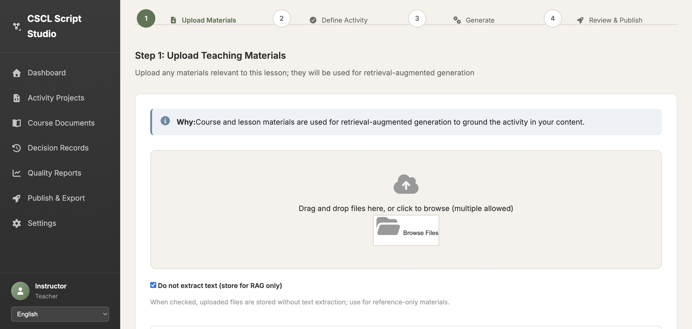
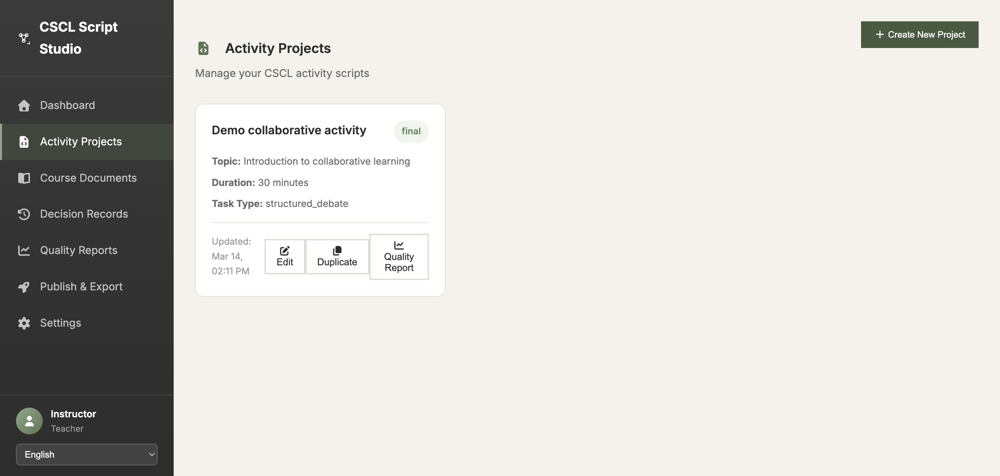
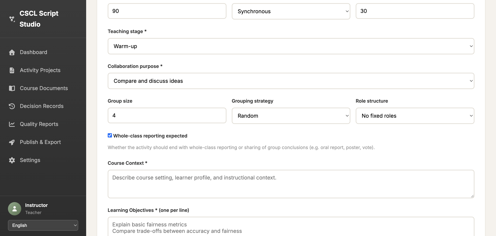

# CSCL 测试结果

## 快速查看

```
测试日期: 2026-03-14
测试URL: https://web-production-591d6.up.railway.app/teacher
测试账号: teacher_demo / Demo@12345
```

## 测试结果

```
┌─────────┬──────────────────────────────────┬──────────┐
│ Issue   │ 问题描述                         │ 状态     │
├─────────┼──────────────────────────────────┼──────────┤
│ #1      │ 文件上传无需选择material_level   │ ✅ 已修复 │
│ #2      │ "不提取文字"复选框默认勾选       │ ✅ 已修复 │
│ #3      │ "已上传的文件"区域存在           │ ✅ 已修复 │
│ #13     │ 活动项目有编辑/复制按钮          │ ✅ 已修复 │
│ #14     │ Step 2顶部有"初步想法"输入框     │ ❌ 未修复 │
│ #8      │ 输出材料有3个标签页              │ ⏭️ 未测试 │
└─────────┴──────────────────────────────────┴──────────┘

统计:
  ✅ 已修复: 4/5 (80%)
  ❌ 未修复: 1/5 (20%)
  ⏭️ 未测试: 1/6
```

## 关键截图

### ✅ Issue #2: 复选框已勾选

**说明:** 可以清楚看到"Do not extract text"复选框前有蓝色勾选标记 ✓

### ✅ Issue #13: 编辑/复制按钮

**说明:** 活动项目卡片上显示 Edit、Duplicate、Quality Report 三个按钮

### ❌ Issue #14: 缺少初步想法输入框

**说明:** Step 2表单直接从"Activity duration"开始，顶部没有"初步想法"输入框

## 详细报告

请查看以下文件获取完整测试报告：

- 📄 [测试结果总结.md](测试结果总结.md) - 中文详细报告
- 📄 [FINAL_TEST_REPORT.md](FINAL_TEST_REPORT.md) - 英文详细报告

## 测试脚本

测试使用的自动化脚本：
- `scripts/test_remaining_issues.py` - 初始版本
- `scripts/test_remaining_issues_v2.py` - 改进版本（修正选择器）

## 后续行动

### 🔴 紧急 - Issue #14
需要在Step 2表单顶部添加"初步想法"输入框

### 🟡 重要 - Issue #8
需要进行完整的生成流程测试，验证3个输出标签页

### 🟢 建议 - 回归测试
修复Issue #14后，重新运行所有测试确保没有引入新问题
